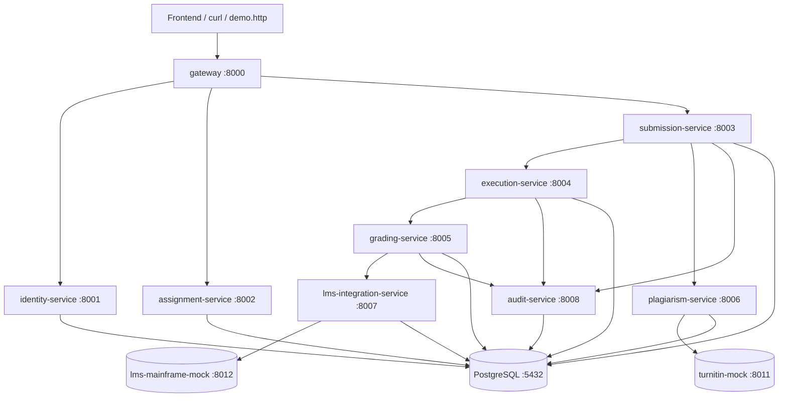

# Arquitectura — CROAK

Plataforma de microservicios para la evaluación automática de tareas de
programación. Stack: Python 3.11 + FastAPI + PostgreSQL 16 + Docker Compose.

## Diagrama de servicios

## Decisiones de arquitectura (ADRs)

### ADR-1 — Arquitectura de microservicios
Cada inciso del kata (ejecución, calificación, plagio, integración LMS, auditoría)
es un dominio con su propio ciclo de vida y, en producción, escalado independiente.
Se separan en servicios pequeños para poder construirlos en **5 streams paralelos**
durante el hackathon sin colisiones. Coste asumido: comunicación HTTP entre servicios.

### ADR-2 — PostgreSQL con un schema por servicio
Requisito del kata: base de datos **relacional**. Se usa una sola instancia de
PostgreSQL con **un schema por servicio** (`identity`, `assignment`, ...): aísla
los datos de cada servicio (*database-per-service* lógico) sin el coste operativo
de varias instancias. **No** hay claves foráneas entre schemas; las relaciones
cruzadas se resuelven por ID + llamada HTTP.

### ADR-3 — Anti-Corruption Layer para el LMS
El LMS de la universidad corre sobre un **mainframe** difícil de modificar y con
una API "tosca" (campos de ancho fijo, códigos numéricos). El
`lms-integration-service` implementa un **Anti-Corruption Layer**: traduce el
modelo limpio interno ↔ el formato del mainframe (`lms-mainframe-mock`), evitando
que la fealdad del sistema legado contamine al resto de la plataforma.

### ADR-4 — Sandbox para ejecutar código no confiable
El código del estudiante es **no confiable**. El `execution-service` lo ejecuta en
un contenedor desechable con `--network=none`, usuario sin privilegios, límites de
CPU/memoria y **timeout duro**. Nunca se ejecuta fuera del sandbox (CLAUDE.md 8).

### ADR-5 — Bitácora de auditoría inmutable con hash-chain
Las notas son auditadas anualmente por entidades estatales (contexto b). El
`audit-service` mantiene un registro **append-only** donde cada evento guarda el
`hash` del evento anterior (`prev_hash`). Alterar un registro rompe la cadena, lo
que hace la bitácora **verificable e inmutable** para la auditoría estatal.

## Patrones aplicados

- **API Gateway / BFF** — `gateway` es el único punto de entrada; valida el JWT.
- **Database per service** — un schema aislado por servicio.
- **Anti-Corruption Layer** — `lms-integration-service` ↔ mainframe.
- **Adapter** — `plagiarism-service` ↔ servicio externo de plagio (`turnitin-mock`).
- **Audit log inmutable** — encadenamiento por hash en `audit-service`.
